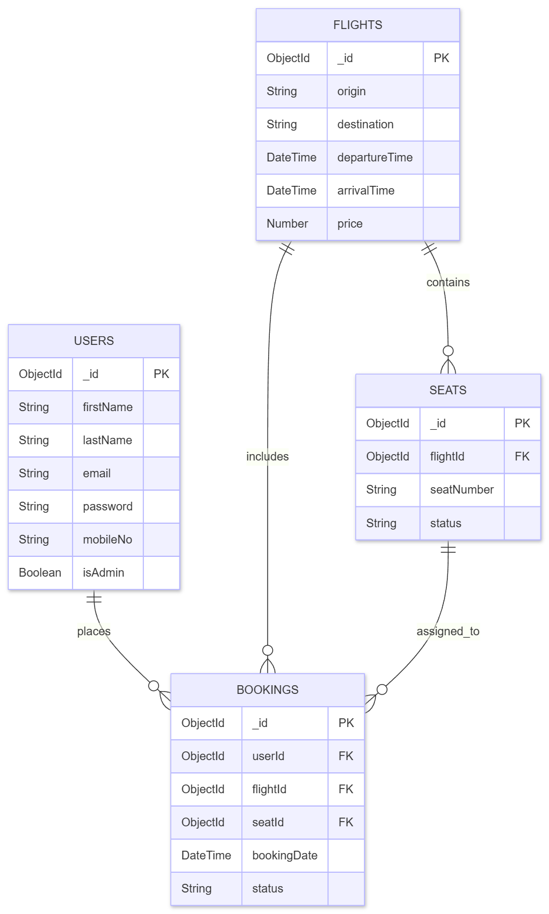

# Technical Specifications Document

## 1. Title Page
| **Project Name** | **FlightDesk - Airline Booking System** |
| :--- | :--- |
| **Version** | 1.0 |
| **Date** | June 21, 2026 |
| **Author(s)** | Jesus de los Santos Jr. |

## 2. Table of Contents
1. [Introduction](#3-introduction)
2. [Overall Description](#4-overall-description)
3. [Visual Mockup Reference](#5-visual-mockup-reference)
4. [Features](#6-features)
5. [Functional Requirements](#7-functional-requirements)
6. [Non-Functional Requirements](#8-non-functional-requirements)
7. [Data Requirements](#9-data-requirements)
8. [External Interface Requirements](#10-external-interface-requirements)
9. [Glossary](#11-glossary)
10. [Appendices](#12-appendices)

## 3. Introduction

- **Purpose**: The purpose of this application is to provide  an airline booking system that allows users to search for flights, book tickets, manage reservations, and simulate basic airline operations.
- **Scope**: 

    The system will:

    * Allow users to search available flights
    * Book and cancel reservations
    * View booking history
    * Simulate seat selection
    * Provide administrative flight management

- **Definitions, Acronyms, and Abbreviations**: 
    - **UI** – User Interface
    - **API** – Application Programming Interface
    - **ERD** – Entity Relationship Diagram
    - **CRUD** – Create, Read, Update, Delete
    - **HTTP** – Hypertext Transfer Protocol: The protocol used for communication between client and server over the web.
    - **REST** – Representational State Transfer: An architectural style used for designing networked APIs.
    - **JSON** – JavaScript Object Notation: A lightweight data format used for data exchange.
    - **Node.js** – A JavaScript runtime environment used for building server-side applications.
    - **Express.js** – A Node.js framework used to build web APIs and backend services.
    - **Vue.js** – A JavaScript framework used for building user interfaces and single-page applications.
    - **MongoDB** – A NoSQL database used to store data in flexible JSON-like documents.
    - **Vercel** – A cloud platform used for deploying and hosting the frontend application.
    - **Render** – A cloud platform used for deploying and hosting backend services and APIs.
    - **Authentication** – The process of verifying the identity of a user.

- **References**: List any documents or sources referenced.

## 4. Overall Description

- **Product Perspective**: AirRoute³ is a standalone web-based prototype system designed to simulate a simplified airline booking platform. It is intended for academic and demonstration purposes.

- **Product Functions**: 
    - Flight search and filtering
    - Flight listing with pricing
    - Seat selection
    - Booking creation and cancellation
    - User authentication (prototype level)
    - Admin flight management

- **User Classes and Characteristics**: 
    - Guest Users: Can search and view flights only
    - Registered Users: Can book flights and manage reservations
    - Admin Users – Can manage flights and view bookings

- **Operating Environment**: 
  The AirRoute³ Airline Booking System is a web-based application designed to run in modern web environments.
    - Frontend: Vue.js
    - Backend: Node.js with Express.js
    - Database: MongoDB
    - API Testing Tool: Postman
    - Deployment: Vercel (Frontend) and Render (Backend)
    - Browser Compatibility: Google Chrome, Microsoft Edge, Mozilla Firefox

- **Assumptions and Dependencies**: 

    **Assumptions:**

    - Flight data is pre-generated and not real-time.
    - Users have basic internet and browser access.
    - Authentication is simplified for prototype use only.
    - No payment processing is included.

    **Dependencies:**

    - Vue.js for frontend development
    - Node.js with Express for backend API
    - MongoDB for database storage
    - Postman for API testing

## 5. Visual Mockup Reference
- **Link or Screenshot**: Provide a link to the visual mockup or include a screenshot.

## 6. Features
- **Feature 1**: Flight Search and Filtering: Allows users to search available flights by destination, departure date, and schedule.
- **Feature 2**: Flight Booking System: Enables registered users to reserve flights and generate booking confirmations.
- **Feature 3**: Seat Selection Module: Provides users with a visual interface for selecting available seats.
- **Feature 4**: Booking Management: Allows users to view and cancel reservations.
- **Feature 5**: User Authentication: Supports user registration and login functionality.
- **Feature 6**: Admin Dashboard Access: The admin dashboard is accessible only to authorized admin users.
- **Feature 7**: Responsive User Interface: Optimized for desktop and mobile browser access.

## 7. Functional Requirements
### Use Cases
- **Use Case 1**:
  - **Title**: Flight Search
  - **Description**: Allows users to search for available flights based on travel details.
  - **Actors**: Guest User, Registered User
  - **Preconditions**: User has access to the application.
  - **Postconditions**: Matching flight results are displayed.
  - **Main Flow**: 
        1. User enters departure and destination locations.
        2. User selects travel date.
        3. System processes the request.
        4. Available flights are displayed.
  - **Alternate Flow**: 
        - No flights are available for the selected schedule.

- **Use Case 2**: 
- **Title**: Flight Booking
  - **Description**: Allows registered users to reserve selected flights.
  - **Actors**: Registered User
  - **Preconditions**: User is logged into the system.
  - **Postconditions**: Reservation is successfully saved.
  - **Main Flow**: 
        1. User selects a flight.
        2. User selects a seat.
        3. System validates seat availability.
        4. Booking confirmation is generated.
  - **Alternate Flow**: 
        - Selected seat becomes unavailable.
        - User cancels the booking process.

- **Use Case 3**: 
- **Title**: Flight Management
  - **Description**: Allows admin to manage flight schedules and details
  - **Actors**: System Administrator
  - **Preconditions**: Admin is logged into the system
  - **Postconditions**: Flight data is updated in the database
  - **Main Flow**: 
        1. Admin accesses admin dashboard
        2. Admin selects “Add / Edit / Delete Flight”
        3. Admin inputs or modifies flight details
        4. System validates data
        5. System saves changes to database
  - **Alternate Flow**: 
        - Invalid input data
        - Database update failure

### System Features
- **Feature 1**:Flight Search System
  - **Description**: Allows users to search for available flights based on travel details such as destination and date.
  - **Priority**: High
  - **Inputs**: Departure location, destination, travel date
  - **Processing**: System queries the database and filters available flights
  - **Outputs**: List of matching flights
  - **Error Handling**: Displays message if no flights are found

- **Feature 2**: Flight Booking System
  - **Description**: Enables registered users to book selected flights and generate reservations.
  - **Priority**: High
  - **Inputs**: Selected flight, user ID, seat selection
  - **Processing**: System validates seat availability and stores booking data
  - **Outputs**: Booking confirmation with PNR (reference code)
  - **Error Handling**: Prevents booking if seat is unavailable or data is invalid

- **Feature 3**:Booking Management System
  - **Description**: Allows users to view and cancel their existing flight reservations.
  - **Priority**: High
  - **Inputs**: User ID, booking ID
  - **Processing**: System retrieves or updates booking records from database
  - **Outputs**: Booking details or cancellation confirmation
  - **Error Handling**: Invalid booking ID or missing record error

- **Feature 4**:User Authentication System
  - **Description**: Handles user registration, login, and session management.
  - **Priority**: High
  - **Inputs**: Email, password
  - **Processing**: System verifies credentials and manages authentication sessions
  - **Outputs**: Login success or failure response
  - **Error Handling**: Invalid credentials or duplicate registration

- **Feature 5**:Seat Selection Module
  - **Description**: Provides interactive seat selection for users during booking.
  - **Priority**: Medium
  - **Inputs**: Flight ID, seat choice
  - **Processing**: System checks seat availability in real-time
  - **Outputs**: Selected seat confirmation
  - **Error Handling**: Prevents selection of already booked seats

- **Feature 6**:Admin Flight Management System
  - **Description**: Allows administrators to manage flight schedules and system data.
  - **Priority**: High
  - **Inputs**: Flight details (origin, destination, time, price)
  - **Processing**: System performs CRUD operations on flight database
  - **Outputs**: Updated flight records
  - **Error Handling**: Rejects invalid data or failed database operations

## 8. Non-Functional Requirements
- **Performance**: The system shall respond to user requests (flight search, booking, and data retrieval) within 2–3 seconds under normal network conditions.
- **Security**: The system shall implement user authentication to protect accounts and restrict access to authorized users only. Passwords shall be securely stored using encryption techniques. API endpoints shall be protected using authentication tokens.
- **Usability**: The system shall provide a clean, intuitive, and responsive user interface accessible on desktop and mobile devices. Navigation shall be simple and consistent across all pages.
- **Reliability**: The system shall maintain a high level of availability during operation with minimal downtime. Data consistency must be ensured during booking and cancellation processes.
- **Supportability**: The system shall follow modular coding practices using Vue.js and Node.js to allow easy maintenance, debugging, and future enhancements.

## 9. Data Requirements
- **Data Models**: 
    - **Users** (User): PK: `_id` | Attributes: `firstName`, `lastName`, `email`, `password`, `mobileNo`, `isAdmin` (Boolean).
    - **Flights** (Flight): PK: `_id` | Attributes: `origin`, `destination`, `departureTime`, `arrivalTime`, `price`.
    - **Seats** (Seat): PK: `_id` | Attributes: `seatNumber`, `status` | FK: `flightId` (ref: Flight).
    - **Bookings** (Booking): PK: `_id` | Attributes: `bookingDate`, `status` | FKs: `userId` (ref: User), `flightId` (ref: Flight), `seatId` (ref: Seat).
    
- **Database Requirements**: 
    - User 1 — * Booking
    - Flight 1 — * Booking
    - Flight 1 — * Seat
    - Seat 1 — 1 Booking (per flight instance)
    
- **Data Storage and Retrieval**: 
    - **Database Architecture:** Data is stored in MongoDB collections using flexible, document-based records.
    - **Single Document Retrieval:** Backend controllers implement the `findOne` method to accurately query exact single documents, ensuring precise data retrieval for specific user profiles or unique booking records.
    - **Flight Search Queries:** The system queries the `Flight` collection by filtering against origin, destination, and departure time parameters.
    - **Booking Transactions:** New reservations are inserted into the `Booking` collection only after validating real-time seat availability, followed by an immediate update to the associated `Seat.status`.
    - **Admin Authorization:** The system actively verifies `User.isAdmin === true` before executing queries to retrieve platform-wide dashboard metrics.

- **ERD**: 

## 10. External Interface Requirements
- **User Interfaces**: 
    The system provides responsive web interfaces for guests, registered users, and administrators. Main pages include:

    - Home Page
    - Flight Search Page
    - Flight Results Page
    - Seat Selection Page
    - Booking Management Page
    - User Login and Registration Pages
    - Admin Dashboard for flight management

- **API Interfaces**: The system uses RESTful APIs developed with Node.js and Express.js to handle communication between the frontend (Vue.js) and backend services. The APIs follow standard CRUD operations for managing users, flights, bookings, seats, and admin functions.

    **User APIs**
    - POST /users/register – Register a new user account
    - POST /users/login – Authenticate user, Admin authentication and generate session/token
    - GET /users/:userId – Retrieve user profile information
    - GET /users/all – View registered users
    - PUT /users/:userId – Update user details
    - DELETE /users/:userId – Delete user account
    
    **Flight APIs**
    - GET /flights – Retrieve all available flights(user), View all flights managed in system(admin)
    - GET /flights/:flightId – Get specific flight details
    - POST /flights – Create a new flight (Admin only)
    - PUT /flights/:flightId – Update flight details (Admin only)
    - DELETE /flights/:flightId – Remove a flight (Admin only)
    - GET /flights/search?origin=&destination=&date= – Search flights based on filters
    - Seat APIs
    - GET /flights/:flightId/seats – Get all seats for a specific flight
    - PUT /seats/:seatId – Update seat status (available/booked)
    - POST /flights/:flightId/seats – Generate seats for a flight (Admin setup)
    
    **Booking APIs**
    - POST /bookings – Create a new booking(user), View all system bookings(admin)
    - GET /bookings/:bookingId – Retrieve booking details
    - GET /users/:userId/bookings – Get all bookings of a user
    - DELETE /bookings/:bookingId – Cancel a booking
    - PUT /bookings/:bookingId – Update booking status
    
    **Admin APIs**
    - GET /dashboard – Retrieve summary data (flights, bookings, users)

- **Hardware Interfaces**: The application requires standard computing devices such as desktops, laptops, tablets, or smartphones with internet access. No specialized hardware is required.

- **Software Interfaces**: 
    - MongoDB for database services
    - Postman for API testing
    - Vercel and Render for deployment and hosting
    - Modern web browsers such as Chrome, Edge, and Firefox

## 11. Glossary

- **API (Application Programming Interface)** – A set of rules that allows communication between the frontend and backend systems.
- **CRUD (Create, Read, Update, Delete)** – Basic database operations used to manage data records.
- **ERD (Entity Relationship Diagram)** – A visual representation of database tables and their relationships.
- **REST (Representational State Transfer)** – An architectural style used for designing network-based APIs.
- **JSON (JavaScript Object Notation)** – A lightweight data format used for exchanging data between client and server.
- **Node.js** – A JavaScript runtime environment used to build server-side applications.
- **Express.js** – A Node.js framework used to create RESTful APIs and backend services.
- **Vue.js** – A JavaScript framework used for building user interfaces and single-page applications.
- **MongoDB** – A NoSQL database that stores data in flexible JSON-like documents.
- **AWS (Amazon Web Services)** – A cloud computing platform used for hosting and deploying applications.
- **Authentication** – The process of verifying the identity of a user before granting access to the system.
- **Authorization** – The process of determining what actions a user is allowed to perform in the system.
- **JWT (JSON Web Token)** – A secure token used for authentication and session management in APIs.
- **PNR (Passenger Name Record)** – A unique booking reference code used to identify a flight reservation.
- **Seat Map** – A representation of available and occupied seats in a flight.
- **Flight Schedule** – The planned departure and arrival times of a flight.
- **Booking** – A confirmed reservation made by a user for a selected flight and seat.
- **Admin Dashboard** – A control panel used by administrators to manage flights, users, and bookings.
- **Middleware** – Functions in backend systems that process requests before reaching the final endpoint.

## 12. Appendices
- **Supporting Information**: 
    - System wireframes and UI mockups for the AirRoute³ application
    - Entity Relationship Diagram (ERD) illustrating database structure and relationships
    - API endpoint documentation for frontend-backend integration
    - Postman test collections used for API validation and testing
    - Additional design references and development notes

- **Revision History**: Record any changes made to the document with dates and descriptions.

    | Version | Date | Description |
| :--- | :--- | :--- |
| 1.0 | May 13, 2026 | Initial version of Technical Specifications Document |
| 1.1 | May 14, 2026 | Formatting and structural revision |
